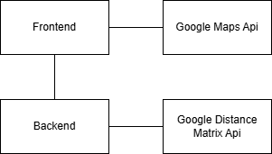

# Kluczowe elementy rozwiązania – uzupełnienie
## Projekt: Optymalna trasa turystyczna

---

# 1. Cel projektu

Celem projektu jest implementacja aplikacji webowej umożliwiającej wyznaczenie optymalnej trasy turystycznej z uwzględnieniem:

- czasu oraz miejsca rozpoczęcia wycieczki,
- miejsc wskazanych przez użytkownika,
- czasu pobytu w miejscach,
- godzin otwarcia,
- opcjonalnej godziny zakończenia wycieczki określonej przez użytkownika
- wybranego środka transportu.

Aplikacja umożliwia planowanie wycieczki możliwej do realizacji:
- pieszo,
- samochodem,
- komunikacją miejską.

---

# 2. Problem optymalizacji

Wyznaczanie optymalnej trasy jest problemem wielokryterialnym.

Algorytm powinien:
- minimalizować czas podróży,
- maksymalizować czas spędzony w atrakcjach,
- uwzględniać godziny otwarcia miejsc,
- spełniać ograniczenia czasowe użytkownika,
- ograniczać liczbę pominiętych atrakcji.

---

# 3. Źródła pozyskiwanych danych

Aplikacja wykorzystuje zewnętrzne API Google do pobierania danych niezbędnych do wyznaczania trasy.

## Google Maps API

Wykorzystywane do:
- pobierania współrzędnych geograficznych miejsc,
- wyszukiwania atrakcji i restauracji,

## Google Distance Matrix API

Wykorzystywane do:
- obliczania czasów przejazdu pomiędzy punktami,
- wyznaczania odległości,
- uwzględniania wybranego środka transportu,
- budowy macierzy czasów przejazdu wykorzystywanej przez algorytm optymalizacji.

## Zakres pozyskiwanych danych

Podczas wyszukiwania miejsc system korzysta z danych udostępnianych przez Google Maps API, takich jak:
- nazwa miejsca,
- adres,
- współrzędne geograficzne.

Po wybraniu punktów przez użytkownika system pobiera dodatkowo:
- godziny otwarcia,
- czasy przejazdu pomiędzy punktami,
- odległości pomiędzy lokalizacjami.

Dane te wykorzystywane są do budowy macierzy odległości oraz działania algorytmu optymalizacji trasy. Macierz odległości budowana jest wyłącznie dla punktów wskazanych przez użytkownika, co pozwala ograniczyć liczbę zapytań do API oraz zmniejszyć koszty wykorzystania usług Google.

---

# 4. Architektura aplikacji

Aplikacja została podzielona na frontend oraz backend.



## Frontend
Frontend odpowiada za:
- interakcję z użytkownikiem,
- pobieranie parametrów wycieczki,
- wizualizację trasy na mapie.

### Technologie
- React,
- React Google maps.

---

## Backend
Backend odpowiada za:
- komunikację z Google API,
- pobieranie danych o miejscach,
- działanie algorytmu optymalizacji,
- generowanie końcowej trasy.

### Technologie
- Python,
- FastAPI,
- NetworkX.

---

# 5. Algorytm optymalizacji

W projekcie zastosowano algorytm zachłanny rozszerzony o obsługę ograniczeń czasowych oraz godzin otwarcia atrakcji.

## Schemat działania

1. Rozpoczęcie wycieczki w punkcie startowym wskazanym przez użytkownika.
2. Wyznaczenie listy nieodwiedzonych atrakcji.
3. Odrzucenie atrakcji, które:
   - są już zamknięte,
   - nie mogą zostać odwiedzone przed godziną zamknięcia,
   - spowodowałyby przekroczenie czasu zakończenia wycieczki.
4. Obliczenie kosztu przejścia do każdej możliwej atrakcji.
5. Uwzględnienie ograniczeń użytkownika:
   - czasu pobytu,
   - maksymalnego czasu wycieczki.
6. Wybór atrakcji o najniższym koszcie.
7. Aktualizacja:
   - aktualnej pozycji użytkownika,
   - bieżącego czasu wycieczki,
   - listy odwiedzonych miejsc.
8. Powtarzanie procesu aż do:
   - odwiedzenia wszystkich atrakcji,
   - braku możliwych do odwiedzenia miejsc,
   - osiągnięcia limitu czasu wycieczki.

---

# 6. Funkcja kosztu

```text
C(i,j) =
  a * t(i,j)
- b * U(j)
- c * A(j)
- d * P(j)
```

Gdzie:

- `t(i,j)` — czas przejazdu pomiędzy punktami,
- `U(j)` — współczynnik pilności wynikający z godziny zamknięcia atrakcji,
- `A(j)` — współczynnik atrakcyjności miejsca,
- `P(j)` — kara za niedopasowanie czasowe względem preferencji użytkownika,
- `a, b, c, d` — współczynniki wag.

---
## Czas przejazdu
Wartość `t(i,j)` odpowiada czasowi przejazdu między szczególnymi punktami. Czas jest przekazywany w sekundach.

## Współczynnik pilności
Wartość `U(j)` to współczynnik pilności. Jest on odwrotnie proporcjonalny do czasu między chwilą obecną, a czasem zamknięcia obiektu, czyli im dłuższy czas do zamknięcia obiektu, tym mniejsza pilność.
`U(j) = (1000 / czas do zamknięcia)`

## Współczynnik atrakcyjności
W sytuacjach, gdzie występuje niewielka różnica funkcji, decydującym elementem może być współczynnik atrakcyjności `A(j) = 100 * liczba gwiazdek`. 

## Kara za niedopasowanie czasowe

Wartość `P(j)` określa stopień niedopasowania czasu odwiedzenia atrakcji do preferencji użytkownika.

Przykładowo:

```text
P(j) = 0
```

jeżeli atrakcja jest odwiedzana w preferowanym przedziale czasowym użytkownika,

```text
P(j) < 0
```

jeżeli użytkownik przybędzie za wcześnie

oraz

```text
P(j) < 0
```

jeśli użytkownik przybędzie za późno.

Dzięki temu algorytm "ciągnie" bardziej do miejsc, które użytkownik chciał odwiedzić wcześniej oraz "odpycha" od tych, które chciał odwiedzić późnij.

---

## Dostrojone współczynniki
``` python
TRAVEL_TIME_WEIGHT = 1
URGENCY_WEIGHT = 21
TIME_WINDOW_PENALTY_WEIGHT = 7
ATTRACTIVENESS_WEIGHT = 4.0
MAX_WAIT_HOURS = 2
```

Największy wpływ na decyzję algorytmu ma współczynnik URGENCY_WEIGHT. Został on ustawiony wysoko, aby ograniczyć sytuacje, w których atrakcyjne, lecz zamykające się wcześniej miejsca były pomijane.

Współczynnik TIME_WINDOW_PENALTY_WEIGHT został ustawiony na poziomie umiarkowanym — preferencje czasowe użytkownika są uwzględniane, ale nie dominują nad czasem podróży ani godzinami zamknięcia obiektów.

ATTRACTIVENESS_WEIGHT posiada relatywnie niewielką wartość, dzięki czemu ocena miejsca działa jako dodatkowa heurystyka poprawiająca jakość trasy, ale nie prowadzi do generowania nieefektywnych objazdów.

Limit MAX_WAIT_HOURS = 2 został dodany w celu eliminacji sytuacji, w których algorytm oczekiwałby wiele godzin na otwarcie kolejnego punktu, co prowadziło do nienaturalnie długich tras.

## Ograniczenia czasowe

Atrakcja może zostać wybrana wyłącznie wtedy, gdy spełnione są następujące warunki:

### Warunek godzin otwarcia

```text
arrival(j) + stay(j) <= closing(j)
```

### Warunek zakończenia wycieczki

```text
currentTime + t(i,j) + stay(j) <= T_end
```

Gdzie:

- `arrival(j)` — przewidywany czas przybycia,
- `stay(j)` — przewidywany czas pobytu,
- `closing(j)` — godzina zamknięcia atrakcji,
- `T_end` — maksymalny czas zakończenia wycieczki.
---

## Charakterystyka algorytmu

Algorytm zachłanny wybiera w każdym kroku lokalnie najlepszą atrakcję na podstawie funkcji kosztu. Rozwiązanie pozwala uzyskać trasę możliwą do realizacji w krótkim czasie obliczeń, jednak nie gwarantuje znalezienia rozwiązania globalnie optymalnego.

# 7. Uwzględnianie ograniczeń użytkownika

Algorytm podczas wyboru kolejnych punktów sprawdza:

- czy użytkownik zdąży odwiedzić punkt przed zamknięciem,
- czy możliwe jest dotrzymanie godziny zakończenia wycieczki,
- czy punkt mieści się w preferowanym przedziale czasowym użytkownika.

Punkty niespełniające ograniczeń krytycznych są odrzucane podczas działania algorytmu. Dotyczy to sytuacji, gdy:

- miejsce jest zamknięte,
- użytkownik nie zdąży zakończyć wizyty przed zamknięciem,
- odwiedzenie punktu spowodowałoby przekroczenie czasu zakończenia wycieczki.

W przypadku naruszenia preferowanego przedziału czasowego punkt nie jest odrzucany, lecz otrzymuje dodatkową motywację w funkcji kosztu. Dzięki temu algorytm stara się zbliżyć do preferencji użytkownika.

---

# 8. Kryteria oceny trasy

Ocena jakości wyznaczonej trasy odbywa się na podstawie:

- całkowitego czasu podróży,
- całkowitego czasu pobytu w atrakcjach,
- liczby odwiedzonych miejsc,
- liczby pominiętych atrakcji,
- liczby naruszeń ograniczeń czasowych,
- długości trasy,
- czasu działania algorytmu.

---

# 9. Testy i scenariusze testowe

Testy mają na celu ocenę:
- jakości wyznaczanych tras,
- wydajności algorytmu,
- praktycznej przydatności rozwiązania.

---

## Scenariusz 1 – Mała liczba punktów

- 5–8 atrakcji,
- brak ograniczeń czasowych.

Cel:
- sprawdzenie poprawności działania algorytmu.

Dla małych przypadków planowane jest porównanie wyników algorytmu zachłannego z algorytmem brute force, który sprawdza wszystkie możliwe permutacje tras i pozwala wyznaczyć rozwiązanie optymalne.

Pozwoli to ocenić jakość rozwiązania heurystycznego.

---

## Scenariusz 2 – Ograniczone godziny otwarcia

- część atrakcji zamykana wcześniej,
- konflikty czasowe pomiędzy punktami.

Cel:
- sprawdzenie poprawności uwzględniania ograniczeń czasowych.

---

## Scenariusz 3 – Ograniczony czas wycieczki

- użytkownik posiada limit czasu,
- liczba atrakcji większa niż możliwa do odwiedzenia.

Cel:
- ocena wyboru najbardziej opłacalnych punktów.

---

## Scenariusz 4 – Duża liczba punktów

- 20 atrakcji.

Cel:
- pomiar czasu działania algorytmu,
- ocena skalowalności rozwiązania.

---

## Scenariusz 5 – Różne środki transportu

- pieszo,
- samochód,
- komunikacja miejska.

Cel:
- porównanie jakości oraz długości tras.

---

## Scenariusz 6 – Konflikty preferencji użytkownika

- wymuszone godziny odwiedzin,
- obowiązkowe punkty,
- ograniczony czas wycieczki.

Cel:
- sprawdzenie działania algorytmu przy wielu jednoczesnych ograniczeniach.

---

# 10. Wyniki działania aplikacji

Wynikiem działania systemu jest:
- wyznaczona trasa wycieczki,
- wizualizacja trasy na mapie,
- kolejność odwiedzanych punktów,
- całkowity czas wycieczki,
- szacowany czas przejazdu oraz pobytu.

# 11. Wyniki testów

# Greedy vs Bruteforce raport

| File | Points | Greedy Places | Brute Places | Greedy Duration | Brute Duration | Avg/Place Greedy | Avg/Place Brute | Speedup |
|---|---|---|---|---|---|---|---|---|
| test_10_places_DRIVE.json | 10 | 10 | 10 | 9h 35min | 9h 32min | 57.51 min | 57.23 min | 44.35x |
| test_10_places_TRANSIT.json | 10 | 8 | 10 | 10h 9min | 11h 48min | 76.14 min | 70.81 min | 32.09x |
| test_10_places_WALK.json | 10 | 6 | 8 | 9h 23min | 11h 53min | 93.90 min | 89.13 min | 30.39x |
| test_conflicts.json | 3 | 1 | 1 | 1h 57min | 1h 57min | 117.00 min | 117.00 min | 0.99x |
| test_simple_5.json | 5 | 4 | 4 | 5h 47min | 5h 47min | 86.81 min | 86.81 min | 1.01x |
| test_with_hour_conflict_DRIVE.json | 3 | 2 | 3 | 1h 7min | 2h 18min | 33.50 min | 46.06 min | 0.99x |
| test_with_hour_conflict_WALK.json | 3 | 2 | 2 | 1h 35min | 1h 35min | 47.59 min | 47.59 min | 1.00x |
| test_with_limited_time.json | 3 | 1 | 1 | 1h 12min | 1h 12min | 72.00 min | 72.00 min | 0.98x |
---

# Test wydajności przy 20 punktach

| File | Points | Visited Places | Trip Duration | Avg/Place | Request Time |
|---|---|---|---|---|---|
| efficiency_test_20.json | 20 | 18 | 4h 3min | 13.53 min | 2.3417s |

# Wnioski z testów

Przeprowadzone testy pozwoliły porównać działanie algorytmu zachłannego (Greedy) oraz algorytmu brute force pod względem:
- jakości generowanych tras,
- liczby odwiedzonych punktów,
- całkowitego czasu wycieczki,
- wydajności obliczeniowej.

---

## Porównanie jakości tras

Najlepsze wyniki algorytm zachłanny osiągnął dla trybu samochodowego (`DRIVE`).

W teście `test_10_places_DRIVE.json`:
- oba algorytmy odwiedziły wszystkie 10 punktów,
- całkowity czas trasy różnił się jedynie o 3 minuty,
- średni czas przypadający na punkt był niemal identyczny.

Oznacza to, że dla tras samochodowych algorytm zachłanny potrafi generować rozwiązania bardzo zbliżone do optimum przy znacznie niższym koszcie obliczeniowym.

---

## Ruch pieszy i komunikacja miejska

Znacznie większe różnice pojawiły się dla trybów:
- `TRANSIT`,
- `WALK`.

W tych scenariuszach brute force odwiedzał większą liczbę punktów:
- `TRANSIT`: 10 punktów vs 8 dla greedy,
- `WALK`: 8 punktów vs 6 dla greedy.

Jednocześnie całkowity czas tras brute force był wyraźnie dłuższy:
- dla komunikacji miejskiej o ponad 1,5 godziny,
- dla ruchu pieszego o około 2,5 godziny.

Pokazuje to, że brute force częściej znajduje rozwiązania maksymalizujące liczbę odwiedzonych miejsc, nawet kosztem znacznie dłuższej wycieczki.

Algorytm zachłanny:
- częściej pomijał część atrakcji,
- ale generował bardziej praktyczne czasowo trasy.

---

## Konflikty godzinowe i ograniczenia czasowe

Testy konfliktów czasowych wykazały poprawne działanie mechanizmu:
- godzin otwarcia,
- limitu oczekiwania,
- ograniczonego czasu wycieczki.

W testach:
- `test_with_hour_conflict_DRIVE.json`,
- `test_with_hour_conflict_WALK.json`,
- `test_with_limited_time.json`,
- `test_conflicts.json`

algorytmy poprawnie odrzucały:
- punkty niemożliwe do odwiedzenia,
- trasy przekraczające limit czasu,
- miejsca wymagające zbyt długiego oczekiwania.

---

## Wydajność obliczeniowa

Największą przewagę algorytmu zachłannego zaobserwowano pod względem czasu działania.

Dla testów obejmujących 10 punktów:
- greedy działał od około `30x` do `44x` szybciej od brute force.

Największe przyspieszenie osiągnięto dla:
- `test_10_places_DRIVE.json` — `44.35x`.

Potwierdza to bardzo dużą różnicę skalowalności pomiędzy podejściami:
- brute force posiada złożoność wykładniczą,
- greedy działa znacznie szybciej i pozostaje praktyczny dla większych zbiorów danych.

---

## Ogólna ocena algorytmów

### Algorytm brute force

#### Zalety
- znajduje rozwiązania bliższe optimum,
- częściej odwiedza większą liczbę punktów,
- lepiej radzi sobie przy skomplikowanych konfliktach czasowych.

#### Wady
- bardzo wysoki koszt obliczeniowy,
- słaba skalowalność dla większej liczby atrakcji.

---

### Algorytm zachłanny (nasz)

#### Zalety
- bardzo szybkie działanie,
- dobra jakość tras dla podróży samochodowych,
- praktyczne zastosowanie dla większych tras miejskich.

#### Wady
- podatność na lokalne optimum,
- częstsze pomijanie punktów w trybach `WALK` i `TRANSIT`.

---

## Podsumowanie

Uzyskane wyniki pokazują, że algorytm zachłanny stanowi rozsądny kompromis pomiędzy:
- jakością wygenerowanej trasy,
- a czasem potrzebnym na jej obliczenie.

Dla praktycznych zastosowań miejskiego planowania wycieczek greedy zapewnia:
- bardzo dobrą wydajność,
- realistyczne trasy,
- akceptowalną jakość wyników,
- szczególnie dla tras samochodowych.

Algorytm brute force pozostaje natomiast wartościowym narzędziem:
- do walidacji jakości heurystyki,
- dla małych scenariuszy testowych,
- oraz do analizy optymalnych rozwiązań referencyjnych.